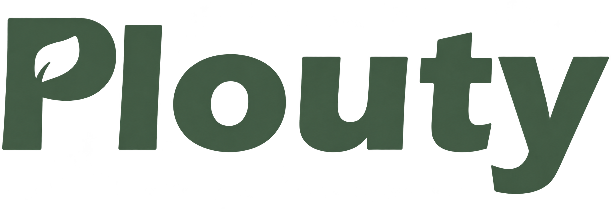

<div align="center">
  
  <h1>Plouty</h1>
</div>

A **Plouty** é um projeto acadêmico desenvolvido para a **FIAP**, alinhado à **ODS 2 — Fome Zero e Agricultura Sustentável**. O protótipo apresenta uma rede profissional agrícola que aproxima pequenos produtores rurais e instituições compradoras, organizando conexões, reputação e descoberta de fornecedores em uma experiência digital acessível e voltada ao contexto brasileiro.

<div align="center">
  <h2>Equipe</h2>
  <p>
    Davi Rabelo<br>
    Enzo Mitev<br>
    Felipe Domingues<br>
    Marcris Filho<br>
    Nicolas Mantovani
  </p>
</div>

## 🌱 Relação com a ODS 2

O projeto acadêmico está alinhado à **ODS 2 — Fome Zero e Agricultura Sustentável**, um dos Objetivos de Desenvolvimento Sustentável da ONU.

A proposta é contribuir para cadeias de abastecimento mais próximas e transparentes, fortalecendo a agricultura familiar e facilitando o acesso de escolas, hospitais, restaurantes e outras instituições a alimentos produzidos regionalmente.

## Objetivo da plataforma

A Plouty busca criar um ambiente profissional baseado em confiança, no qual produtores e instituições possam se conhecer, avaliar informações comerciais e iniciar relações de fornecimento com menos barreiras.

O protótipo atual concentra-se na apresentação dessa experiência, utilizando perfis e dados demonstrativos locais, sem backend ou autenticação real.

## ✨ Funcionalidades atuais

- entrada demonstrativa com escolha entre **Produtor** e **Instituição**;
- sessão local mantida durante a aba atual do navegador;
- feed social com três publicações demonstrativas e estáveis;
- curtidas locais nas publicações;
- resumo do usuário, assuntos em pauta e sugestões de conexão;
- catálogo de produtores e cooperativas;
- busca por nome, produto, localização ou descrição;
- filtros por tipo de produção, região e avaliação mínima;
- cards comerciais com reputação, entregas, disponibilidade e verificações;
- painel responsivo de mensagens com conversas demonstrativas;
- envio de mensagens mantido somente durante a sessão da interface;
- formulário de contato com validação local;
- temas claro e escuro;
- navegação responsiva para desktop, tablet e celular;
- avatares e imagens locais com fallback para iniciais ou placeholders.

## 🧰 Tecnologias utilizadas

- **React 18**;
- **Vite 6**;
- **React Router 7**;
- **Bootstrap 5**;
- **Bootstrap Icons**;
- **Context API** para tema e sessão demonstrativa;
- **CSS customizado** com tokens para temas claro e escuro.

## Páginas disponíveis

- **`/`** — entrada pública da demonstração;
- **`/entrar`** — formulário de acesso e seleção do perfil demonstrativo;
- **`/inicio`** — feed social da rede Plouty, protegido pela sessão local;
- **`/explorar`** — catálogo de produtores e cooperativas, protegido pela sessão local;
- **`/sobre`** — apresentação institucional da Plouty e de sua relação com a ODS 2;
- **`/contato`** — canal demonstrativo de contato e suporte.

Produtores e instituições podem acessar as áreas protegidas. Quando não existe uma sessão demonstrativa ativa, o acesso direto a essas páginas redireciona para a entrada.

## 🚀 Instalação e execução

### Pré-requisitos

- Node.js instalado;
- npm disponível no terminal.

### Executar em desenvolvimento

```bash
npm install
npm run dev
```

A aplicação será disponibilizada em:

```text
http://localhost:3000
```

### Gerar e visualizar a versão de produção

```bash
npm run build
npm run preview
```

No Windows, caso o PowerShell bloqueie o comando `npm`, utilize `npm.cmd` nos mesmos comandos.

## 📁 Estrutura resumida

```text
Plouty-Connecting/
├── public/
│   └── images/             # Logo, imagem institucional e mídias demonstrativas
├── src/
│   ├── components/         # Componentes comuns, sociais, de layout e exploração
│   ├── context/            # Sessão demonstrativa e tema
│   ├── data/               # Mocks estáveis utilizados pela interface
│   ├── hooks/              # Hooks reutilizáveis
│   ├── pages/              # Páginas atualmente disponíveis
│   ├── styles/             # Tokens e estilos globais da aplicação
│   ├── App.jsx             # Rotas e composição principal
│   └── main.jsx            # Inicialização do React
├── index.html
├── package.json
└── vite.config.js
```

## ⚠️ Caráter demonstrativo e limitações

Este repositório representa um **protótipo de interface**. Atualmente:

- não existe backend, banco de dados ou autenticação real;
- o perfil selecionado é armazenado em `sessionStorage` apenas para a demonstração;
- as conversas vêm de mocks fixos e novas mensagens permanecem somente em memória;
- o formulário de contato valida os dados, mas não os envia para um servidor;
- o campo de criação de publicação fornece feedback visual, mas ainda não adiciona um novo post ao feed;
- o upload de imagens ainda não está disponível;
- curtidas, perfis salvos e solicitações de conexão não possuem persistência remota;
- comentários, republicações e compartilhamentos não estão ativos na interface atual;
- os dados de reputação, entregas, perfis e instituições são fictícios e estáveis.

## 🗺️ Funcionalidades planejadas para fases futuras

As próximas fases poderão incluir:

- backend e autenticação de usuários;
- persistência de perfis, publicações, mensagens e conexões;
- upload de imagens para publicações;
- comentários, republicações e compartilhamentos;
- notificações persistentes;
- fluxos de oportunidades, demandas, propostas, negociações e contratos;
- páginas próprias de perfil e evolução do sistema de reputação.

Essas funcionalidades fazem parte da evolução planejada e **não estão implementadas no estado atual do projeto**.
---

<div align="center">
  Projeto acadêmico desenvolvido com foco em agricultura sustentável, confiança e impacto social.
</div>
